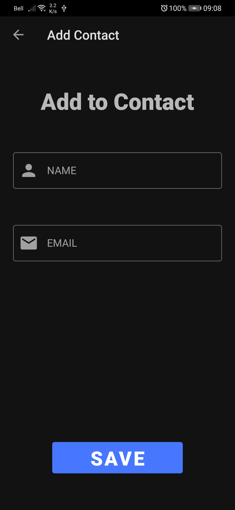
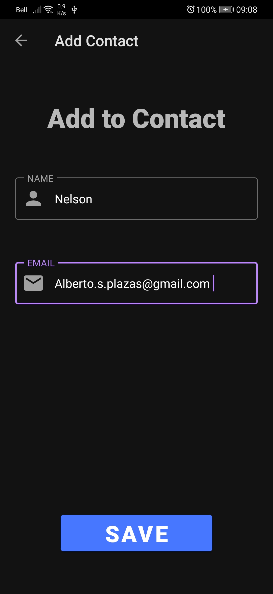
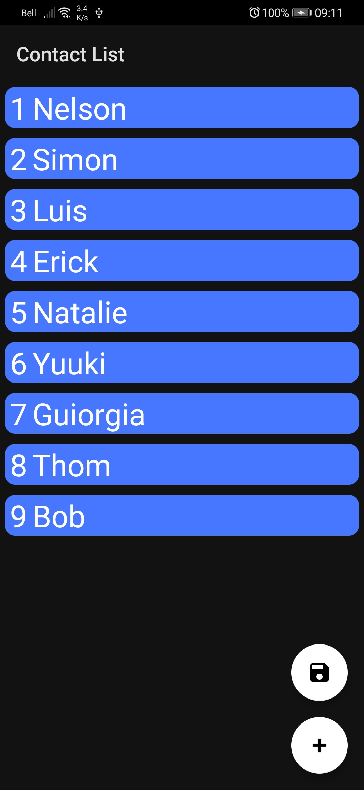
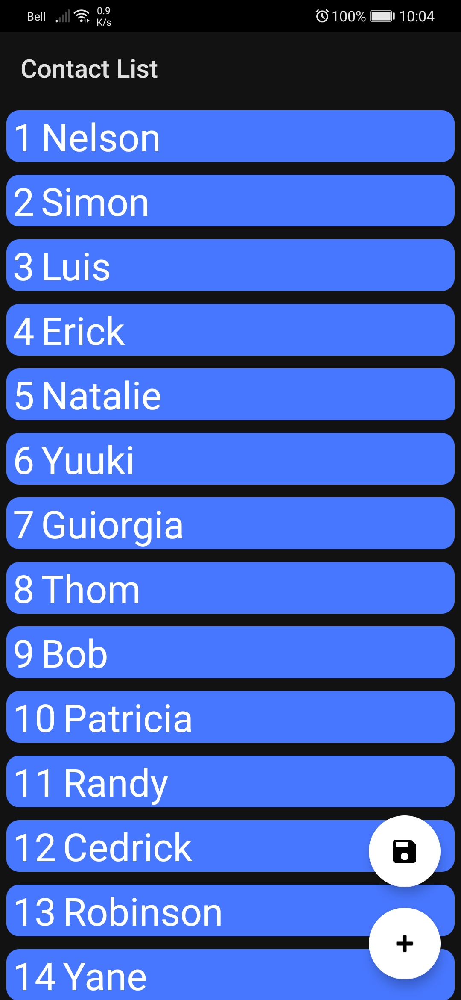
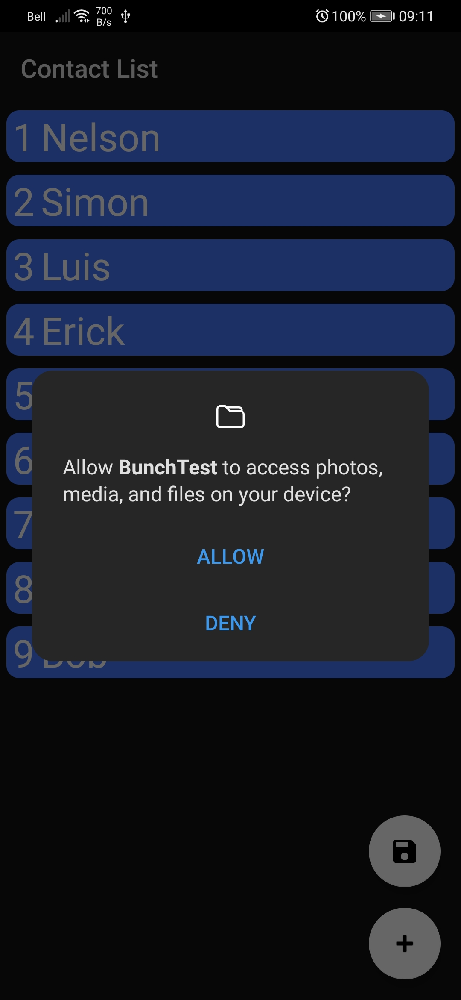
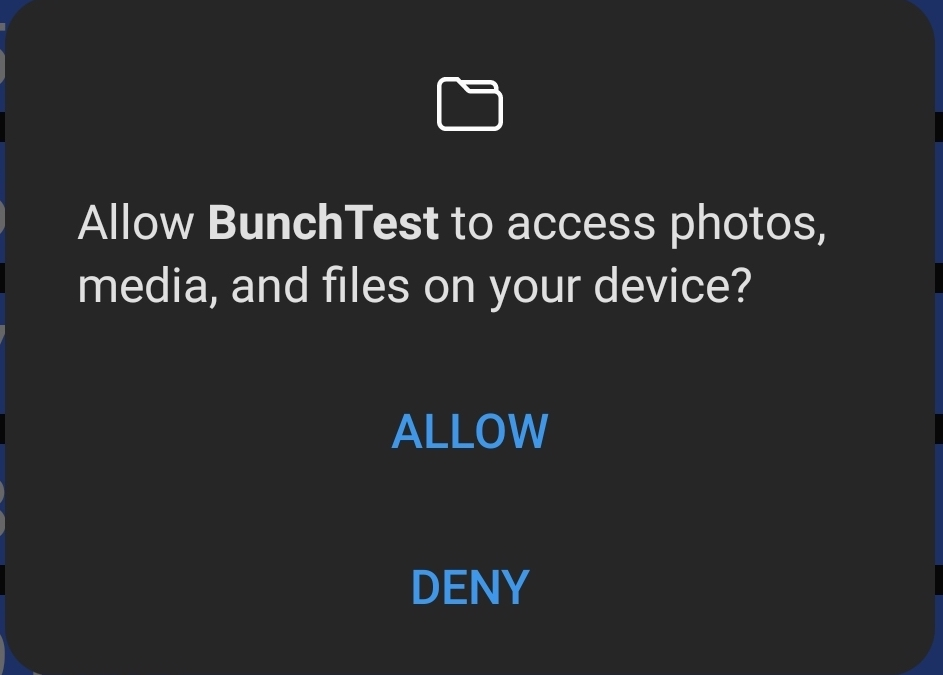
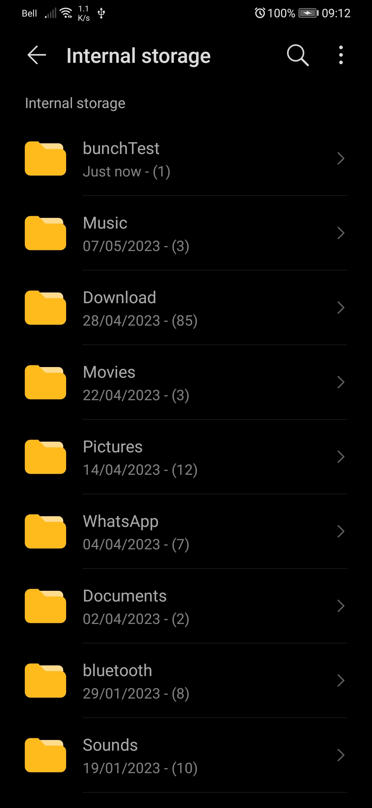
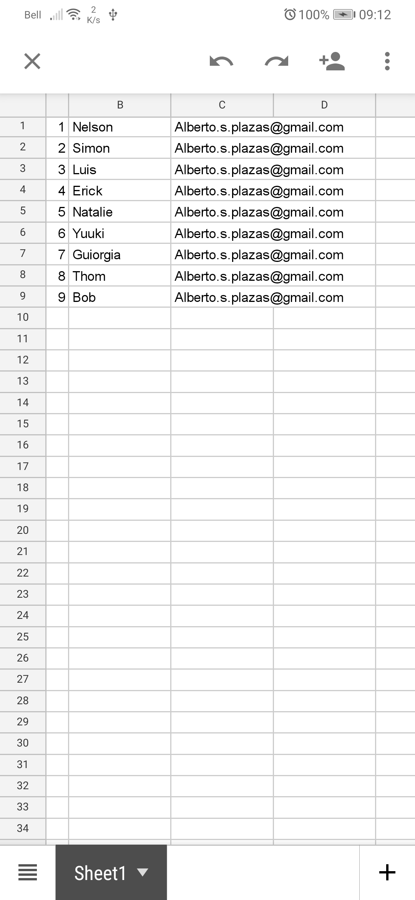
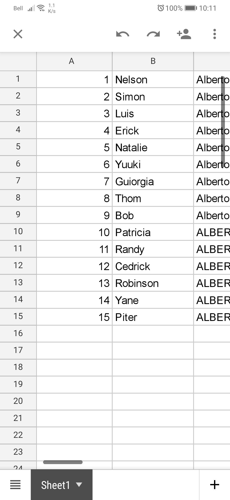

## Libraries ##

- _Hilt_
- _Android navigation_
- _Retrofit_
- _Android navigation_
- _Room_
- _Gson_
- _Lottie_

## APK ##

[APK](https://drive.google.com/file/d/1f6dkYRJ5eEJithFMzpKDrQbETQN7mJGE/view?usp=sharing)

## References ##

[Architecture Android](https://github.com/Eli-Fox/LEGO-Catalog)

[Guide to app architecture](https://developer.android.com/jetpack/guide)

[Eli-Fox LEGO ](https://proandroiddev.com/android-architecture-starring-kotlin-coroutines-jetpack-mvvm-room-paging-retrofit-and-dagger-7749b2bae5f7)

## Views ##

| Project                                                                                                                                                                                                                                                                                                                                                                                                                                                                                                                                              |                                                                                              |
|:-----------------------------------------------------------------------------------------------------------------------------------------------------------------------------------------------------------------------------------------------------------------------------------------------------------------------------------------------------------------------------------------------------------------------------------------------------------------------------------------------------------------------------------------------------|----------------------------------------------------------------------------------------------|
|  </img>    A sample blog post viewer that demonstrates the use of Compose with a typical Material app and real-world architecture.    • Medium complexity • Varied UI • Light & dark themes • Resource loading • UI Testing    **[> Browse](JetNews/)**                                                                                                                                                                                                   |                              |
|                                                                                                                                                                                                                                                                                                                                                                                                                                                                                                                                                      |                                                                                              |
|  </img>   A sample chat app that focuses on UI state patterns and text input.  • Low complexity • Material Design 3 theme and Material You dynamic color • Resource loading • Back button handling • Integration with Architecture Components: Navigation, Fragments, LiveData, ViewModel • Animation • UI Testing  **[> Browse](Jetchat/)**                                                                                                        |                              |
|                                                                                                                                                                                                                                                                                                                                                                                                                                                                                                                                                      |                                                                                              |
|  </img>   A sample survey app that showcases text input, validation and UI state management in Compose.  • Low complexity • `TextField` and form validation • Snackbar implementation • Element reusability and styling • Various form elements   **[> Browse](Jetsurvey/)**                                                                                                                                                                         |                            |
|                                                                                                                                                                                                                                                                                                                                                                                                                                                                                                                                                      |                                                                                              |
|  </img>   Jetsnack is a sample snack ordering app built with Compose.  • Medium complexity • Custom design system • Custom layouts • Animation  **[> Browse](Jetsnack/)**                                                                                                                                                                                                                                                                                   |                             |
|                                                                                                                                                                                                                                                                                                                                                                                                                                                                                                                                                      |                                                                                              |
|  </img>   A sample podcast app that features a full-featured, Redux-style architecture and showcases dynamic themes.  • Advanced sample • Dynamic theming using podcast artwork • Image fetching • [`WindowInsets`](https://developer.android.com/reference/kotlin/android/view/WindowInsets) support • Coroutines • Local storage with Room  **[> Browse](Jetcaster/)**                                                                             |                            |
|                                                                                                                                                                                                                                                                                                                                                                                                                                                                                                                                                      |                                                                                              |
|  </img>    A Compose implementation of the Rally Material study, a financial app that focuses on data, charts, reusability and animations.  • Low complexity • Material theming with a dark-only theme • Custom layouts and reusable elements • Charts and tables • Animations • Screenshot tests  **[> Browse](Rally/)**                                                                                                                                |                                |
|                                                                                                                                                                                                                                                                                                                                                                                                                                                                                                                                                      |                                                                                              |

